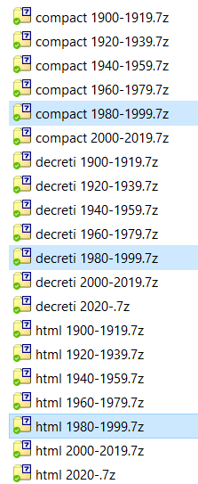

# DuraLex

Siccome nel momento del bisogno non trovavo repository digitali strutturati per recuperare i codici e le fonti di diritto e normative (ho scoperto solo dopo altri repository come WikiSource che sono probabilmente più semplici da parsare), mi sono [tirato giù i dati](https://www.youtube.com/watch?v=Sl-hzJtPYeg) da alcuni siti che forniscono un servizio di consultazione.

Li metto qui a disposizione perché un repository strutturato è utile nello sviluppo di applicazioni mobile e microservizi.

Non sono sicuro di niente, ma questi dati dovrebbero essere pubblici quindi non dovrebbero esserci problemi a renderli tali. Forse ci sono problemi nelle modalità in cui li ho scaricati, se è così cancello il repository immediatamente. Questi dati sono stati recuperati *a scopo di studio*! 

## Repository

Il repository è un estratto di un progetto che non ho più a disposizione, ma il codice (ad esempio il network utile per fare analisi sui grafi) è semplice da reintegrare in un'applicazione che utilizza le librerie [JGraphT](https://jgrapht.org/).

Contiene:
* html - delle pagine html con degli esperimenti sulla ricerca di articoli
* json - i file json con gli articoli
* model - i modelli corrispondenti alla struttura dei dati presenti sui json
* scraper - gli scraper utilizzati per recuperare i codici

## File Json
I file DuraLex_*.json contengono tutti gli articoli. In particolare:

* DuraLex_All.json - Contiene tutti gli articoli in un array
* DuraLex_Compact.json - Contiene un LegalIndex

La differenza è che nel secondo caso il LegalIndex è un treeset di Collezioni corrispondenti ai codici, che al loro interno contengono gli articoli.

# Decreti

Ho anche scaricato tutti i decreti compresi quelli regi dal 1900 in poi. Ne metto a disposizione un sottoinsieme che contiene i decreti **dal 1980 al 1999**, dovrebbe già esserci un numero interessante di leggi ad personam.

Carico un sample su questo repository ridotto a sufficienza per poter essere caricato, nella cartella **decreti**, che contiene in particolare:
* compact 1995-1999.7z - Tutti i decreti legge in due modalità espansa e compatta (sulla struttura organizzata per codici)
* decreti 1995-1999.7z - Tutti i decreti legge organizzati per anno e con un item per articolo
* html 1995-1999.7z - tutti i file html dai quali ho effettuato il parsing

